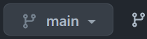
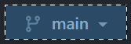
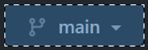

# Paint.NET Selection Editor

Paint.NET の選択範囲テキストを編集する WEB アプリケーション

画面キャプチャーしたあと、ダイアログなどの特定の場所だけをぴったり切り取りたい、というときに使用します。たとえば次の画像からボタンだけを切り取りやすくします。

 

Paint.NET は選択範囲を操作するメニューが少ないので、作成しました。


## 使用方法

[Paint\.NET Selection Editor](https://hossy3.github.io/paintdotnet-selection-editor/)


まず Paint.NET で「選択範囲自体をコピー `Ctrl+Alt+Shift+C`」 し、本アプリケーションに「貼り付け」します。

ボタンで選択範囲を編集します。

|機能|操作前|操作後|使用例|
|---|---|---|---|
|四角形にする|||自動選択結果を単純にする|
|拡大|||四角形に周辺の枠を追加する|
|選択範囲を編集|||数値で指定する|
|穴の除去|||外形を維持する|

編集が終わったあと「コピー」します。そして Paint.NET で「選択範囲自体を貼り付け `Ctrl+Alt+Shift+V`」します。

## 技術情報

### インストールと実行

```console
npm install
npm run start
```

### 選択範囲の編集方法

Paint.NET の選択範囲は、クリップボード経由で読み書きできます。

たとえば次のように、2つのポリゴンの通過点列が得られます。内外判定はポリゴンの重なり数の偶奇性で行われます。2つのポリゴンが重なった内側の四角は、選択範囲ではない「穴」となっています。

```
{
  "polygonList": [
    "367,331,363,331,363,326,367,326",
    "371,324,361,324,361,334,371,334"
  ]
}
```

```
(361,324) 2行目のループ
│(363,326) 1行目のループ
↓↓
┌────┐
│┌─┐ │
│└─┘ │←(367,331) 1行目のループ
└────┘←(371,334) 2行目のループ
```

* 四角形にする: bounding box にします
* 拡大: box を上下左右に 1px 広げます
* 穴の除去: ポリゴン上の1点が他のポリゴンのループ内にあるときに穴とみなし、そのループを取り除きます
  * ループが交差しないことを前提としています
  * ループの回転方向は考慮していません

参考: ['Callout Selection' plugin development \- Plugin Developer's Central \- paint\.net Forum](https://forums.getpaint.net/topic/117999-callout-selection-plugin-development/)

### Fluent UI React v9, Canvas

Qiita に投稿予定


## License
MIT

